07_Django_workshop

---

> Django Model Form 을 활용해 CRUD를 모두 갖춘 장고 프로젝트를 제작하고 결과 사진과 코드를 별도의 마크다운 파일에 작성하여 제출하시오.

### 결과 사진

---

* 메인화면

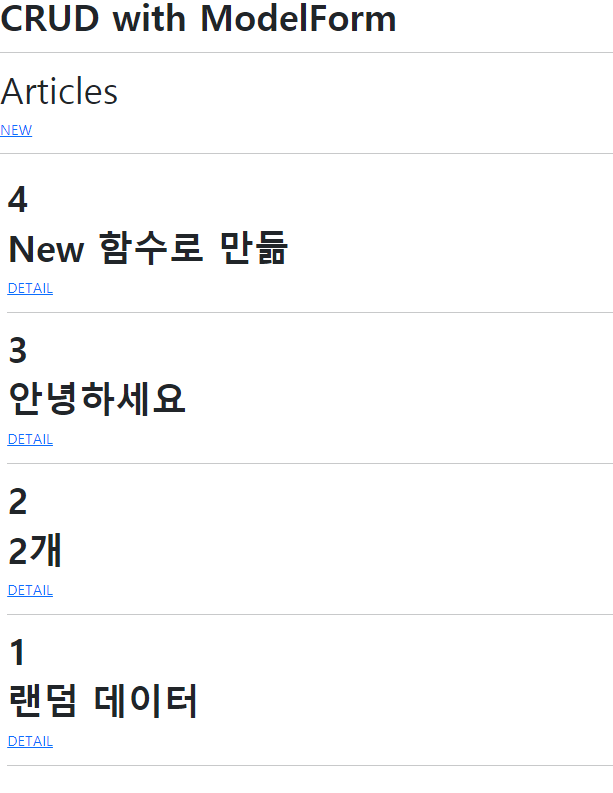

* 글 작성

  

* 글 수정

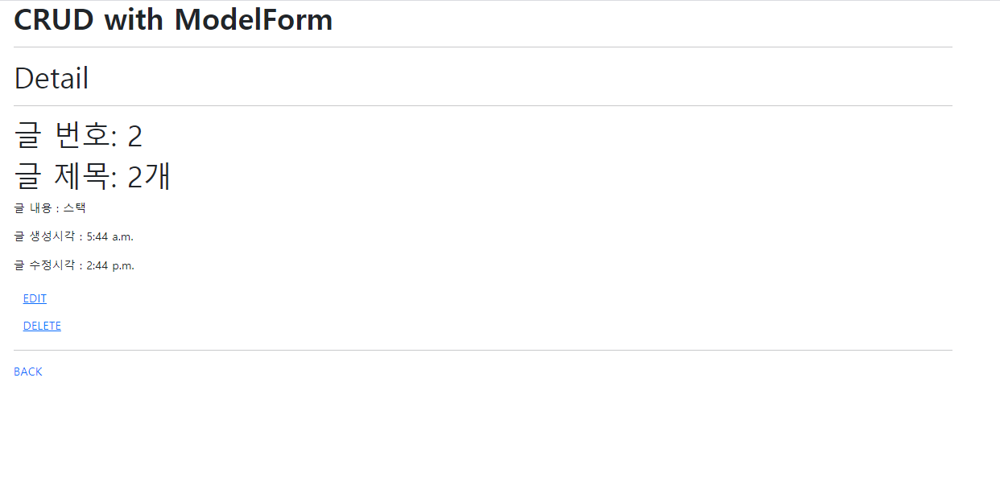

* 글 삭제

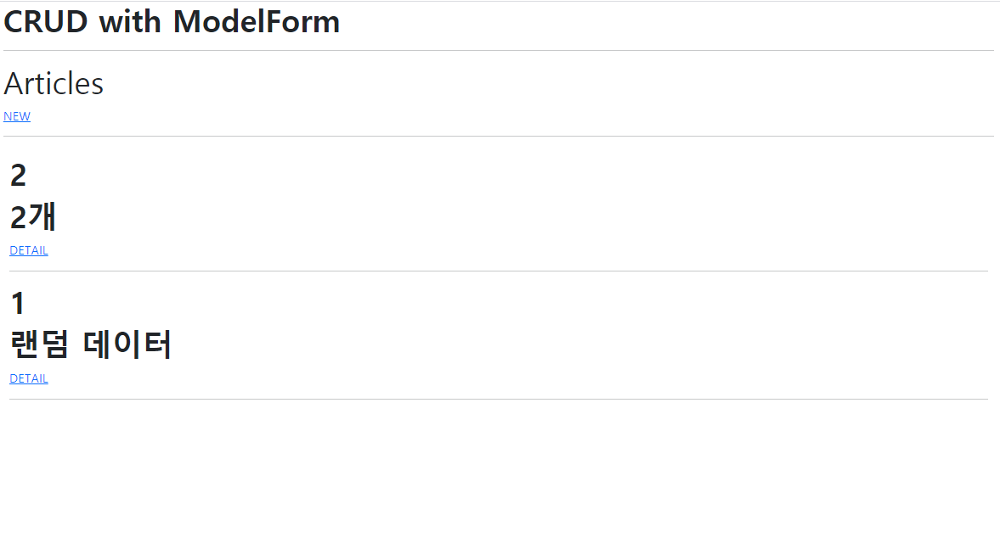

### 템플릿 코드

---

* base.html (기본이 되는 html 파일)

  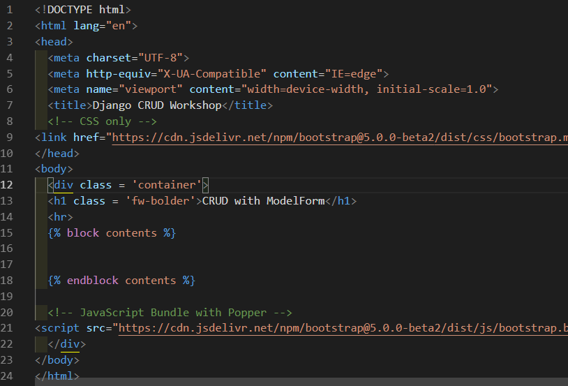****

* index.html (메인화면. 사용자에게 DB에 저장된 게시글들을 보여준다.)

  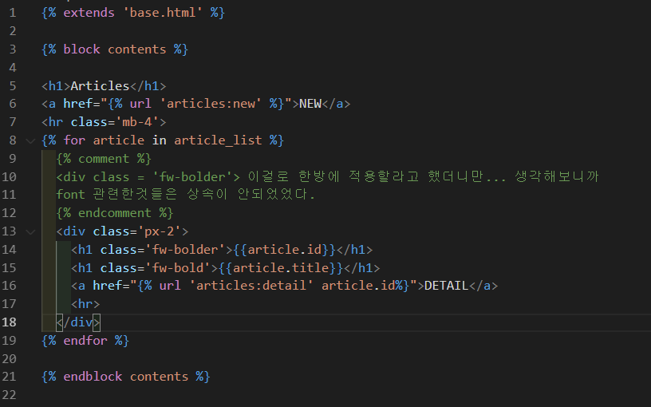

* new.html ( 사용자에게 새로운 글 작성하는 빈 폼을 제공하는 문서)
* 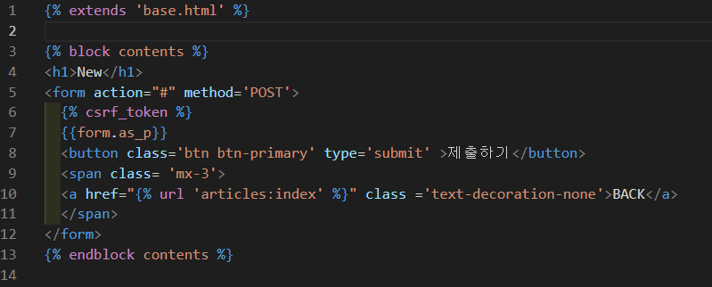

* Detail.html ( 게시글의 상세 내용을 보여주는 문서)

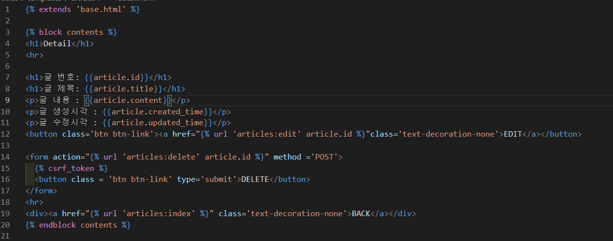

* Update.html (get 요청이 오면, 기존의 게시글을 보여주고, post 요청을 보낼 수도 있는 문서)

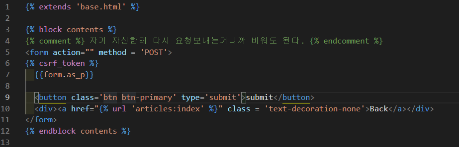

### urls.py

---

* articles > urls.py

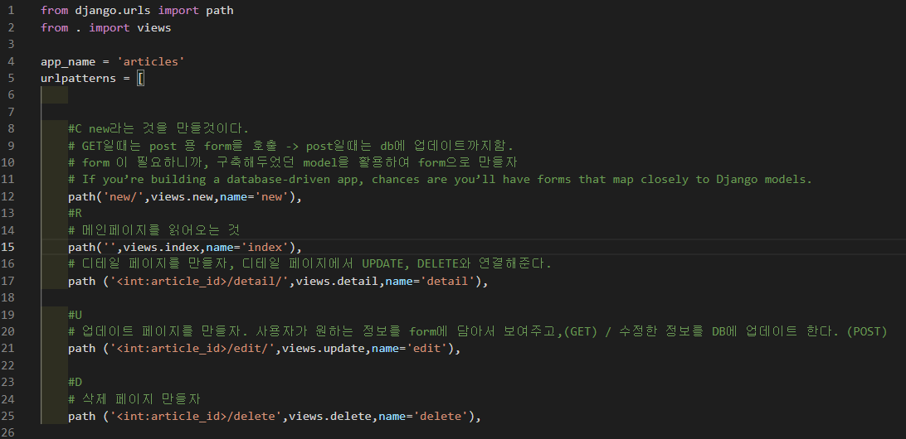

* crud > urls.py

  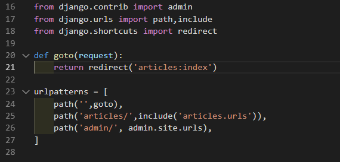

> 8000 으로 접속해도 articles 페이지로 리다이렉트 되게 구성하였다.

### Views.py

---

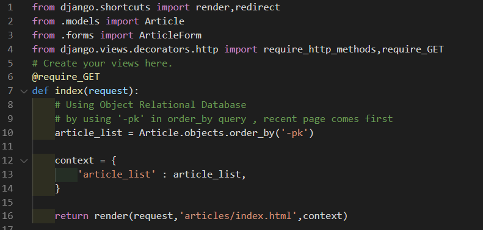

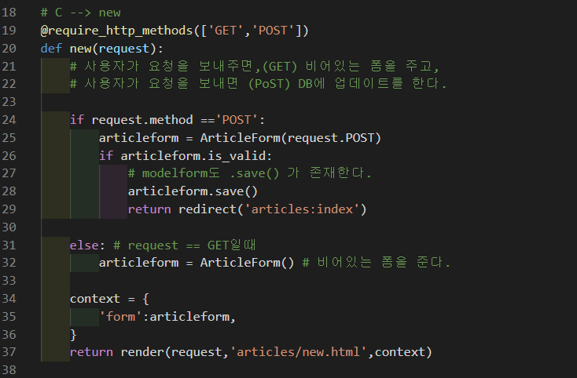

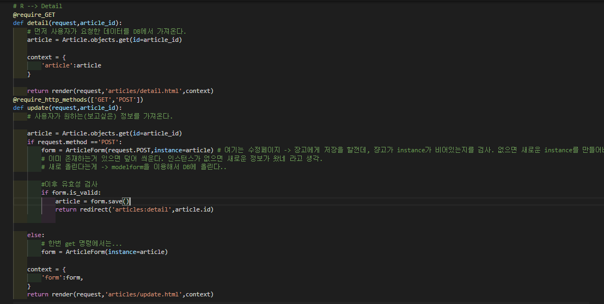

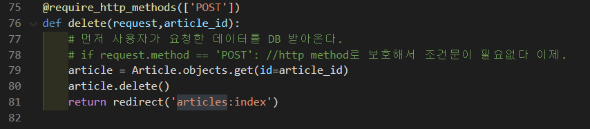

### Models.py

---

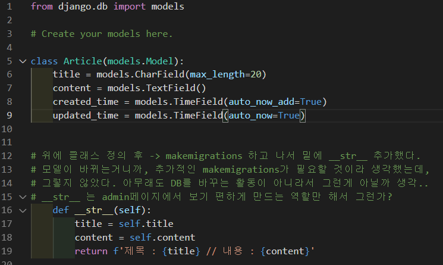

> 모델 구성 후 , makemigrations -> migrate --> admin.py에 등록

### forms.py

---

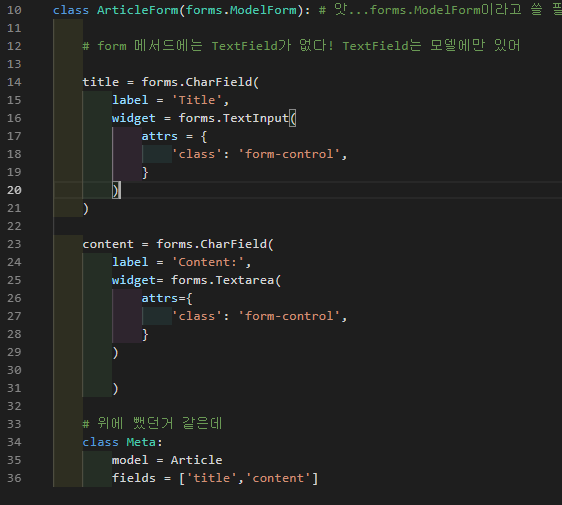

### 🎈강평

---

* 쟝고는 반복으로 학습하는 것 같다. 처음에는 그냥 코드만 따라하는 수준이였는데, 명령어와 흐름이 이제 눈에 보이는 것 같다
* 또, 이번 과제를 통해서 ModelForm은 instance가 주어지지 않으면 Django가 알아서 instance를 생성해준다는 사실을 알게 되었다. 그래서 Update 기능을 수행할때, parameter인 instance를 지정해줘야지 새로운 form이 만들어지는것을 막을 수 있다.