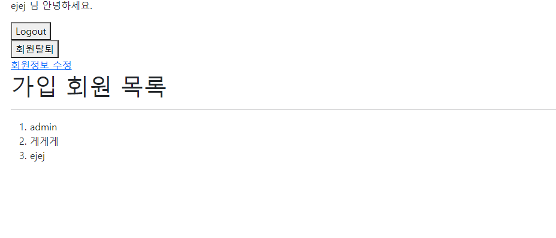
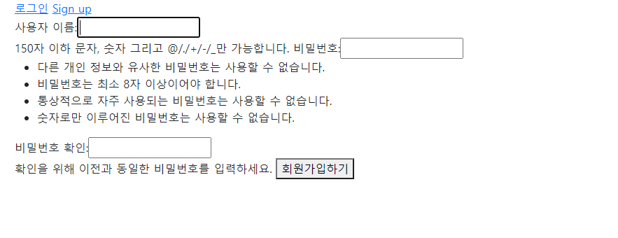
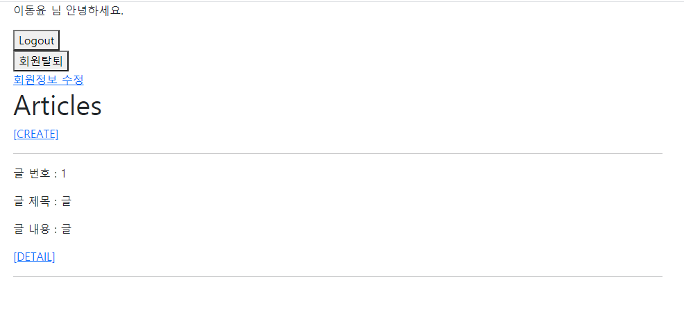

### 08_Django_workshop

---


### 1. /accounts/

> 유저 목록을 출력하는 페이지를 나타낸다


* **핵심** : get_user_model의 사용
* 진행 과정
  * 1. get_user_model을 import
    2. get_user_model을 이용해서 현재 활성화된 유저 모델을 반환받고, 변수에 저장
    3. 저장된 변수를 ORM을 이용해서 DB에 저장된 값 꺼내온다.
    4. html 화면에 출력


#### 코드

---

```python
#urls.py
from django.urls import path
from . import views

app_name ='accounts'
urlpatterns = [
    path('',views.index,name='index'),
]
```


```python
#views.py

#(전략)#

from django.contrib.auth import get_user_model

def index(request):
    User = get_user_model() # 생성자 () 입력하는거 잊지 말자!
    user = User.objects.all() # 변수화 되었으므로 ORM을 사용할 수 있다.
    context = {
        'user': user,
    }
	return render(request,'accounts/index.html',context)

```


```django
<!--index.html-->

<h1>가입 회원 목록</h1>
<hr>
<ol>

  <li>{{user.username}}</li>

</ol>
```


#### 결과

---





#### 2. /accounts/signup/

> 회원가입 작성을 위한 페이지를 나타낸다. 유저를 생성하는 기능을 수행한다.


* 핵심 : UserCreationForm의 활용

* 진행과정 : 

  * 1. django.contrib.auth.form에서 UserCreationForm을 불러온다

    2.  요청일 GET일때와 POST일때로 나눈다.

    3.  GET일때는 비어있는 Form을 사용자에게 주고, POST일때는 request.POST에 담겨있는 데이터로 채워서 넘겨준다

    4. html에 출력한다

       

```python
#urls.py
from django.urls import path
from . import views

app_name ='accounts'
urlpatterns = [
    #Signup
    path('signup/',views.signup,name='signup'),

]
```


```python
#views.py

#(전략)#
from django.contrib.auth.forms import UserCreationForm
from django.contrib.auth import login as auth_login

def signup(request):
    if request.method =='POST':
        form = UserCreationForm(request.POST)
        if form.is_valid():
            user = form.save() # 데이터 베이스에 회원 정보 생성
            auth_login(request, user) # 세션 생성 == 로그인 
            return redirect('articles:index')
    #GET
    else:
        form = UserCreationForm()
    context = {
        'form':form,
    }
    return render(request,'accounts/signup.html',context)
```


```django
<!--signup.html-->




<form action="" method="POST">
  
  {{ form }}
  <button>회원가입하기</button>
</form>



```


#### 결과

---




* 가입 후 메인 페이지로 리턴

