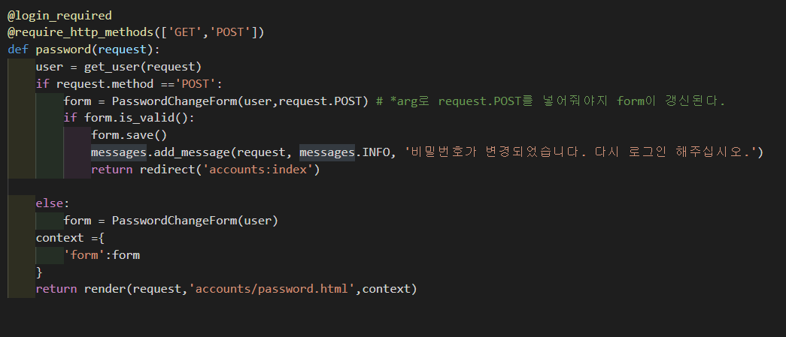
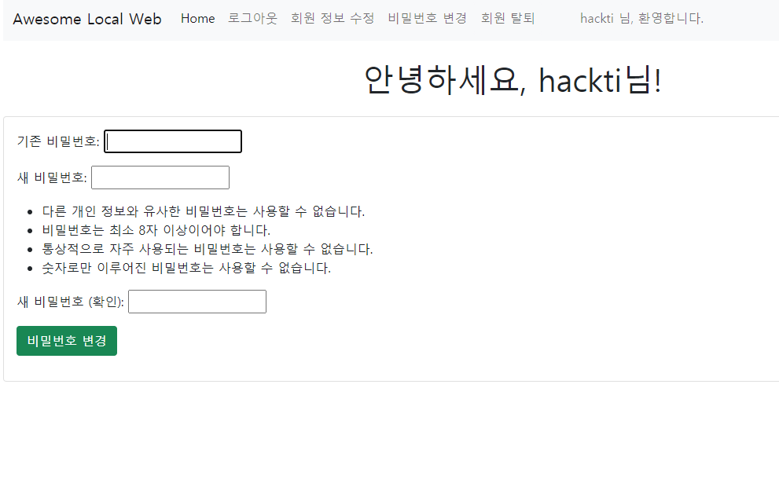
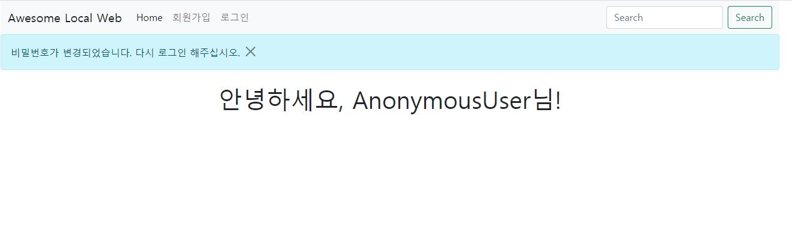

### 09_Django_workshop

---

#### 1. User Change Password

> /accounts/password/url을 가지며, 유저의 비밀번호 수정 기능을 구현한다.

* PasswordChangeForm은 첫번째 인자로 user객체를 받는다. 이 점만 알고 있으면, 나머지 CRUD 기능과 동일하게 구성하면 된다. Form은 Django가 알아서 만들어주기 때문에, Form 관련한 부분은 신경쓰지 않아도 된다.
* 추가로, 비밀번호가 변경되었을시, message 기능을 이용해서 화면에 alert 창으로 비밀번호가 변경되었다는 1회성 메시지를 띄우게 하였다.

#### 결과

---

