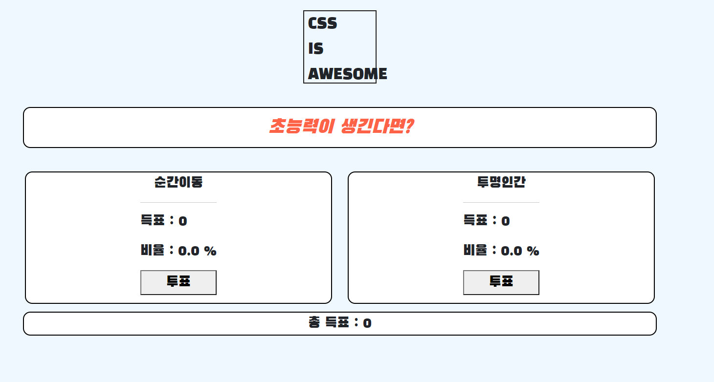
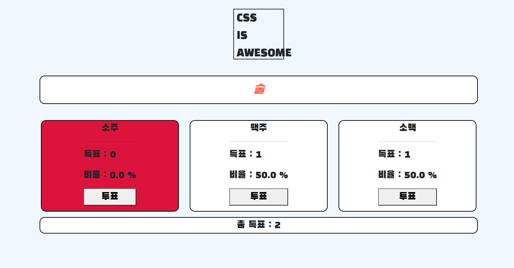
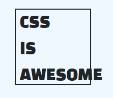

### 13_django_workshop

---

> Either Project를 제작하시오.


#### 설계의도

---

* 기본적으로 명세에 따름. 2가지 선택지가 주어지고, 둘 중 하나를 선택하고, 결과를 보여줍니다.
* 하지만 거기서 한 발 더 나가, 3지 선택, 4지 선택까지 커버할 수 있는 로컬을 만들고자 하였습니다.
* 위 기능을 구현하기 위해, 최대한 파이썬 답게 구현한다. template tag와 model을 적절히 설계하여 데이터의 유실, 낭비가 없도록 하는 것을 목표로 하였습니다.
* 추가로, 스타일링도 가급적 bootstrap 컴포넌트가 아닌, 제가 배운 css와 JS를 최대한 이용했습니다.


#### 결과 화면

---





* 투표 버튼을 누르던가, 새로고침 할 때마다, 해당 페이지로 리다이렉트가 되는데, 그때마다 벡엔드에서 db에 저장된 랜덤한 문제를 로드해옵니다.
* 화면에는 각 항목들의 득표 수와, 비율, 투표에 참석한 사람들의 수가 나옵니다.



* 3지 선다 질문도 등장하는데, bootstrap의 gridsystem을 이용하여 문항 수가 늘더라도, 자동적으로 화면비를 맞추게 구성하였습니다.
* 또한, JS를 이용하여 (static 파일로 연결), 마우스를 올리면 각 항목의 색깔이 바뀌게 하였습니다. 이때는 Addeventlistener를 이용하여 "mouseover"와 "mouseout" 이벤트를 감지하게 하여 각 부분을 감지하게 하였습니다. 이때, QuerySelector로 각 선택지들의 ID를 지정하려고 하였는데, 해당 선택지들은  태그로 반복 출력 되고 있는 상황이라, 각 선택지마다 다른 아이디를 부여하기 힘들었습니다.
* 이때, django에  이라는 태그의 존재를 알게 되었습니다. cycle 태그는 이 태그가 encounter 될 때마다 , 내포하고 있는 인수들을 생성하는데, 이를 for문에 사용하게 된다면, 각 선택지마다 다른 id를 부여할 수 있었습니다.

```django
# cycle 예시


    <tr class="">
        ...
    </tr>


```


```django
# cycle 활용

# 전략

<h1 class = 'title text-center my-5 box p-3'>{{ question }}</h1>
<div class = 'row'>
  
  <div class = 'col d-flex justify-content-center box mx-3' id='' >
    <form action="" method="POST">
      
      <p class= 'text-center'>
        {{ answer.answer_text }}
          
# 후략
```

* 보시다시피, 매 answer 마다 id가 rect1 -> rect2 -> rect3 순으로 부여되고 있습니다. 
* 여기서 아쉬웠던 점이 , 최초 설계 목적은 선택지가  몇 개나 와도 소화할 수 있는 페이지를 만드는 것이였는데, 여기서는 id를 직접 하나하나 타이핑 해줬습니다.  이러한 아이디도 선택지의 크기에 따라 자동적으로 부여할 수 있는 방법이 없을지 추가로 고려해봐야겠습니다.


#### 백엔드에서는...

---

* 쿼리셋을 다루기가 쉽지 않았습니다. 특히, 저는 각 정답에 대한 백분율을 구하기 위해, DB 영역이 아니라, Python에서 직접 계산 후 변수화하는 과정을 거쳤는데, 그 중 쿼리셋 데이터를 조작하는데 상당히 애를 먹었습니다.

* 특히 쿼리셋 데이터를 조작할 때는, 끝까지 값을 빼낸 다음, 저장해서 변수화 하라는 것을 배웠습니다.

```python
 # 문제의 코드. answers[idx].percent = percent_lst[idx]이후 .save()가 안되는 상황이였습니다.
    percent_lst =[0 for _ in range(len(vote_values))]
    for idx in range(len(vote_lst)):
        answer_tem = answers[idx] # 여기서 쿼리셋을 하나의 변수로 다시 저장해줬습니다.
        percent_lst[idx] = percents(vote_lst[idx],total)
        answer_tem.percent = percent_lst[idx]
        answer_tem.save()
```

* 자세히는 이해하지 못했으나, id로 찍어보니까 따로 변수화 해서 저장해야지만 다른 값을 나타내고, 저장도 잘 되었습니다. 아무래도 쿼리셋의 규칙은 일반적인 파이썬 규칙과 뭔가 다르다는 결론을 내렸습니다.

  아직 두루뭉실하게 밖에 답을 내리지 못하는데, ORM과 DB의 관계에 대해서도 더 확고한 답을 내릴 수 있도록 정진해야겠다는 생각도 듭니다.


#### 한편 JS는...

---

```javascript

function react1(){

  var myRect = document.querySelector("#rect1");
  myRect.addEventListener("mouseover", function() {  // mouseover 이벤트 처리
    myRect.style.backgroundColor = "crimson";  // myRect 요소의 배경색 
  });
  myRect.addEventListener("mouseout", function() {  // mouseout 이벤트 처리
    myRect.style.backgroundColor = "";  // myRect 요소의 배경색 지우기 
  });
}
function react2(){

  var myRect = document.querySelector("#rect2");
  myRect.addEventListener("mouseover", function() {  
    myRect.style.backgroundColor = "Cyan";  
  });
  myRect.addEventListener("mouseout", function() {  
    myRect.style.backgroundColor = "";  
  });
}

function react3(){

  var myRect = document.querySelector("#rect3");
  myRect.addEventListener("mouseover", function() {  
    myRect.style.backgroundColor = "green";  
  });
  myRect.addEventListener("mouseout", function() {  
    myRect.style.backgroundColor = "";  
  });
}

function init(){

  react1();
  react2();
  react3();

}

init();

```


* 예습한거 한번 써보겠다고 까불어봤는데, 상당히 좋지 못한 코드가 나왔습니다. 제가 생각하는 개선점은 2가지입니다.
  1. 같은 코드가 계속 반복된다. (react 1,2,3 모두 backgroundColor와 querySelector 만 조금씩 다르고 나머지는 완전 똑같음 ) --> 냄새나는 코드의 첫 번째 요건 달성
  2. 이 뻘짓을 한 결과가 css로 간단히 구현할 수 있는 결과와 별반 차이가 없음. JS를 써본건 좋았으나, 이 정도 퍼포먼스 뿐이라면, 굳이 JS를 썼어야하나? 라는 생각이 드는것도 사실이다.


#### 강평 

---

* 회원 가입 기능을 구현해, 가입한 인원만 투표를 할 수 있다든가, 투표한 사람의 이름이 뜬다든가, 나와 같은 선택을 한 유저 이름을 출력한다는등의 다양한 기능을 구현하고 싶었는데, 시간 문제도 있었고, 제가 거기까지 구현하기에는 아직 실력이 모자란다는 생각이 들었습니다.
* 또한, font만 바꿔도 분위기가 확 산다는 것을 직접 느꼈습니다. 이번에 처음으로 웹 폰트를 사용해봤는데, 자주 사용할 것 같습니다.
* 마지막으로, 그래도 여러가지 시도를 해볼수 있어서 좋았습니다. 처음에 과제가 주어졌을 때는 내가 이걸 어떻게 하지? 라는 생각이 (매번 그렇지만) 드는데, 교수님의 지도편달 덕분에 깔끔한 결과를 낼 수 있었습니다. 덕분에 오늘도 후련한 하루를 보냈습니다. 
* 정말 마지막으로,



제가 만들었지만 너무 예쁘게 잘 만든거 같습니다.