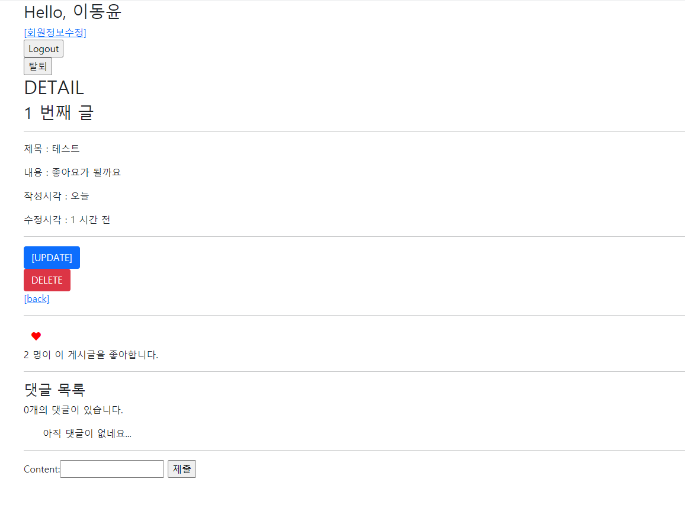

### 14/ 15 WorkShop

---


**이번 마크다운은 보고서라기 보다는 코드 작성 간 들었던 생각과 구현 방향을 거의 날 것 그대로 작성한 것입니다. 때문에 가독성이 떨어지지만 양해 부탁드리겠습니다. 주말 간 복습하여 깔끔하게 다시 정리해보겠습니다.** 


1.먼저 좋아요 기능부터 구현하겠습니다.


 User와 Article 간의 M:N 관계가 성립( 하나의 유저는 여러개의 게시글을 좋아할 수 있다. 여러명의 유저는 하나의 게시글을 좋아할 수 있다.)


Article에 M2M 필드 추가

```python
user_like= models.ManyToManyField(settings.AUTH_USER_MODEL, related_name= 'article_like') # article과 user 둘 다를 위해 M2M 필드를 만들자

```


views.py 수정

```
def like(request,article_pk):
    # 1. 좋아요 누른 게시글의 인스턴스를 가져온다
    article = get_object_or_404(Article,pk=article_pk)
    # 2. 좋아요 누른 사람 정보를 가져온다.
    user = request.user
    # 3. article(게시글 인스턴스)의 user_like 속성에 사람을 집어 넣는다
    article.user_like.add(user.pk) # M2M< 필드 이므로
    # 4. 반환 해준다
    return redirect('articles:detail', article_pk)
```


프론트 html 수정

-> 사실 좋아요 기능에서는 프론트가 제일 중요한거 같습니다. (손이 많이 감)

```django
# detail.html

 좋아요 영역 
  <hr>
  <form action="" method='POST'>
    
    <button>좋아요</button>
  </form>
  <hr>
```


이후 몇 명이 좋아요를 눌렀는지 표시도 해줍니다.


```django
	  
    좋아요의 갯수는 소스모델의 길이로 잰다. 
    즉, Article 모델에서 나를 참조하고 있는 user_id의 갯수를 세어야한다.
    현재 model 관계에서는 Article에 M2M 필드가 있으니, 정참조를 할 수 있다.
    
  
  {{ article.user_like.all | length }} 명이 이 게시글을 좋아합니다.
```

* 처음에는 article이 like보다 더 상위에 있는것으로 생각해, 역참조를 하려고 했습니다. (왜 상위 개념이라고 역참조를 해야한다고 생각했는지도 모르겠습니다.)   하지만 다음과 같이 생각해보기로 했습니다.

```
user_like= models.ManyToManyField(settings.AUTH_USER_MODEL, related_name= 'article_like')
```

이 필드를 위해 views에서 

```
article.user_like.add(user.pk)
```

를 사용합니다. add의 사전적 의미를 생각해보면 "더한다"라는 뜻입니다. 즉, user_like에 더한다라고 해석할수 있습니다. 그렇다면, article.user_like는 **article에 더해진 객체를 찾는다** 라고 해석이 됩니다.(실제로는 manager와 유사하게 동작)

따라서, article.user_like.all은 article에 더해진 객체를 모두 가져와라 라는 뜻입니다.(article에서 user를 참조/ article에 있는 user를 지칭)

이 코드에서 like를 하면 article에 user가 더해지므로, 이 게시글에 좋아요한 유저들의 모음을 가져오려면 article.user_like.all을 통해서 article에 더해진 모든 객체를 가져오면 됩니다. 그렇기 때문에, related_name을 쓰는 것이 아닌, fieldname을 쓰는 것입니다.


반대로 user모델에는 user_like 필드가 없기에 related_name을 씁니다. 이때의 의미는 현재 user 중에서 article에 들어가 있는 user를 가져와라 라는 뜻이 됩니다.


더욱 쉽게 말하자면, M:N 필드에서는 클래스 변수를 manager처럼 사용한다고 생각하면 됩니다.

또한, 소스 모델과 타겟 모델 간의 관계를 생각하면서 코드를 작성하면 한결 더 수월해집니다.


* 추가 과정 (좋아요 버튼 아이콘 화)

  -> fontawesome에서 script 가져온 후, detail의 form 부분을 변경하면 됩니다. -> pass

* 좋아요 취소 기능 구현

```python
@login_required
def like(request,article_pk):
    article = get_object_or_404(Article,pk=article_pk)
    user = request.user
    
    if not article.user_like.filter(pk=user.pk).exists():
        article.user_like.add(user)
    else:
        article.user_like.remove(user)
        
    return redirect('articles:detail', article_pk)
```


* 여기서는 filter query set을 사용하는데, filter는 조건에 맞지 않아도 무조건 queryset을 돌려주기 때문이다.
* 이후, exists() 메서드를 이용해, 현재 요청을 보내는 유저가 article.user_like에 속해 있으면,  M:N 테이블에서 지워주고 (remove) , 없으면 더해줍니다 (add)


#### 결과 사진




2. 팔로우 기능 구현


* 팔로우 기능은 유저와 유저 간의 관계를 나타내므로, User table을 수정합니다.


```python
# accounts / models.py
class User(AbstractUser):
    followings = models.ManyToManyField(
        'self', 
        symmetrical= False,
        related_name='followers'
        )
```


여기서 주의해야할 점은 

1. 참조할 모델은 자기 자신이므로 self로 지칭합니다. 그런데 여기서 반드시 문자열로 표기해줘야합니다. M2M 필드에서 자기 자신을 참조하는 경우에는 문자열로 감싸줘야 하는 규칙이 있습니다. 자세한 구동 과정은 알지 못하나, 아마도 self를 따옴표 없이 작성한다면 django는 self를 찾기 위해 models.py 전체를 살피게 되는데, 그 과정에서 self를 찾지 못해서 오류가 납니다.  물론, python의 class에서 self는 자기 자신을 지칭하는 것임을 알고 있습니다. 그러나 특수한 예외라고 생각하면 좋을 것 같습니다.

* 추가 정보 ( models.py 에서 참조할 모델 지정할 때 따옴표를 쓰지 않아도 좋은 경우와 써야하는 경우 )

    따옴표 안쓰는 경우 : 

  ​	1. 모델 클래스를 직접 지원

    따옴표 쓰는 경우 : 

  ​	1.재귀 관계가 필요할 때,

  2. 아직 정의되지 않은 모델 참조할때,

     3.다른 응용 프로그램에서 모델을 참조하는 바로가기.

    **따옴표 꼭 써줘야하는 경우: 위치상 아직 정의되지 않은 모델을 지정할 때** 

2. symmetrical 옵션은 대칭관계를 나타내는 경우입니다. 이것이 True가 되면 한 레코드가 다른 레코드와 관계를 맺게 되면, 상대방 레코드도 관계를 맺은 레코드와 자동으로 관계를 맺게 되는데, 이는 우리가 구현하려고 하는 팔로우/팔로워 기능의 목적과 부합하지 않으므로 false로 바꿔줍니다.

3.  related_name : User는 자기 자신과 M:N 관계를 맺는 재귀적 테이블입니다. 내가 팔로우 버튼을 눌렀을때, 나에게 해당 유저의 정보가 들어가게 될 것입니다. 내게 더해진 유저( 내가 참조하는 유저 / 내가 관심가지는 유저) 는 팔로잉 대상이므로, 필드명은 followings가 적절합니다.

   반면, 자신에게 나를 더한 유저 (나를 참조하는 유저/ 나에게 관심가지는 유저는) 팔로워이므로, related_name은 followers가 적절합니다.


-> 이후 마이그레이트 진행해주고, account의 url로 넘어갑니다. ( 변경한 모델이 account이므로 더 적절하다고 판단)


```python
    # 프로필 페이지
    path('<str:username>/', views.profile, name='profile'),
    # 팔로우 버튼
    path('<int:pk>/follow',views.follow,name='follow'),
```

* 인스타그램처럼, 유저 네임을 url로 사용하도록 하겠습니다.


* views

  ```python
  def profile(request, username):
      # 1. 현재 요청을 보낸 유저가 보고자 하는 유저를 가져온다.
      User = get_user_model()
  
      profile_user = User.objects.get(username = username)
      # 2. 그 사람에 대한 정보를 추출하기
      context ={
          'profile_user': profile_user,
      }
      return render(request, 'accounts/profile.html',context)
  
  def follow(request,pk):
      # 0. 현재 이 함수에 들어온 상황은 유저가 팔로우 버튼을 눌렀을 때이다.
      user = get_user_model()
      me = request.user
      person = get_object_or_404(user, pk=pk)
  
      # 1. 만약 너의 팔로워 중에서 내가 없다면 -> 추가
      # 1.1 있으면 -> 제외
      if person.followers.filter(pk=me.pk).exists():
          person.followers.remove(me)
      else:
          person.followers.add(me)
  
  
  
      return redirect('accounts:profile', me.username)
  ```

  

* 여기서 잘못 생각했던게, profile 페이지를 먼저 만들고 팔로우 기능을 구현했어야하는데, follow부터 만들면서 팔로우 이후에 profile.html을 랜더링 하려고 했습니다. 전형적인 암기 구현이라고 할 수 있겠습니다... 반성해야할 부분입니다.
* 또한, 신경 써야할 부분이, follow 함수에서 profile로 리다이렉트 해줄때, profile에 username을 toss 해줘야합니다. 이 점을 놓쳐서 좀 많이 헤맸습니다.


profile.html 수정

```django




<h1>{{  profile_user }}님의 프로필 페이지</h1>

<form action="" method="POST">
  
  
    <button>언팔로우</button>
  
    <button>팔로우</button>
  
</form>


 팔로워 목록 
<p> 나의 팔로워</p>

<p>
  {{follower}}
</p>


 팔로잉 목록 
<p>내가 팔로잉하는 사람</p>

  <p>{{ following }}</p>

<a href="">돌아가기</a>

```


 model에서의 M:N 관계를 잘 생각하여 적절한 변수 명을 지으면, 생각한 그대로 코드가 동작합니다. 묘하게 이것이 웹에서의 그리디 알고리즘인가? 라는 생각이 들 정도입니다. 


여기서 profile_user는 사용자가 클릭한 유저입니다. 따라서 그 유저의 팔로잉 대상은 .following으로 접근할 수 있고, 팔로워는 followers로 접근 가능합니다


* 한편 이해가 가지 않는 부분은

  ```django
  
  ```

  

이 부분입니다. 여기서 profile_user의 타입은 lazy 인데, 이게 어째서 model 클래스인 request.user와 같은 레벨에서 비교가 되는지 모르겠습니다... 어쩌다 설계목적대로 코딩을 하긴 했는데, 원리를 이해하지 못해서 난감합니다. 이번 주말 간에 추가 학습이 필요하겠습니다.

