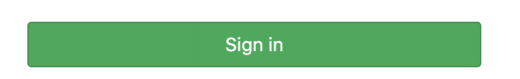
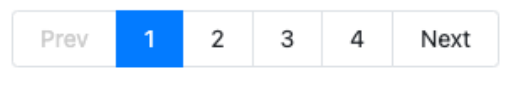
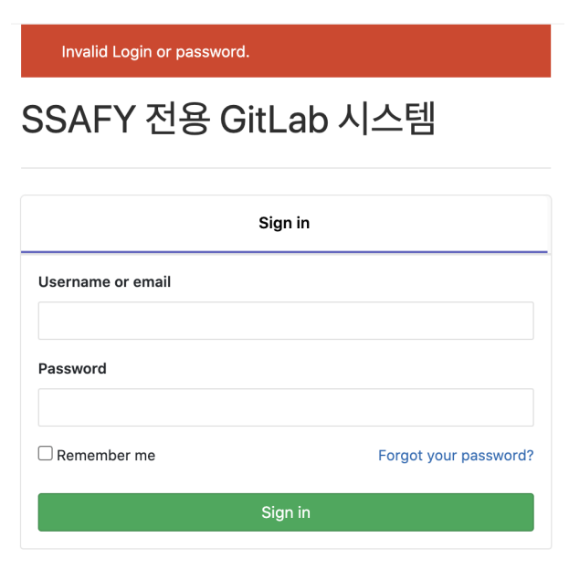

# Web 03 homework

> 1) 각 문항에 제시된 이미즌 현재 lab.ssafy.com 에서 사용중인 components이다. 제시된 요소에 사용된 Bootstrap Component가 무엇인지 작성하시오.
>
> 2) 위에서 답한 BootStrap Component를 사용하여 제시된 요소와 유사한 형태가 되도록 코드를 작성하시오.


### 1.

---





* Button components 이다. 


```html
  <div class="d-grid gap-2 col-6 mx-auto">
    <button style="margin-top: 20px;" class="btn btn-success" type="button">
        Sign in
      </button>
  </div>

```


### 2.

---


* navbar components이다.

```html
<nav class="navbar navbar-expand-lg navbar-light bg-light">
    <div class="container-fluid bg-dark">
      <a class="navbar-brand" href="#"></a>
      <button class="navbar-toggler" type="button" data-bs-toggle="collapse" data-bs-target="#navbarNavDropdown" aria-controls="navbarNavDropdown" aria-expanded="false" aria-label="Toggle navigation">
        <span class="navbar-toggler-icon"></span>
      </button>
      <div class="collapse navbar-collapse" id="navbarNavDropdown">
        <ul class="navbar-nav">
          <li class="nav-item dropdown">
            <a class="nav-link dropdown-toggle text-white" href="#" id="projects" role="button" data-bs-toggle="dropdown" aria-expanded="false">
              프로젝트 
            </a>
          </li>
          <li class="nav-item">
            <a class="nav-link dropdown-toggle text-white" href="#" id="groups" role="button" data-bs-toggle="dropdown" aria-expanded="false">
              그룹들
            </a>
          </li>
          <li class="nav-item">
            <a class="nav-link text-white" href="#">
              활동
            </a>
          </li>
          <li class="nav-item">
            <a class="nav-link text-white" href="#">
              마일스톤
            </a>
          </li>
          <li class="nav-item">
            <a class="nav-link text-white" href="#">
              스니펫
            </a>
          </li>
        </ul>
      </div>
    </div>
  </nav>
```


### 3.

---




* Pagination components이다.


```html
<nav aria-label="...">
  <ul class="pagination">
    <li class="page-item disabled">
      <a class="page-link" href="#" tabindex="-1" aria-disabled="true">Previous</a>
    </li>
    <li class="page-item"><a class="page-link" href="#">1</a></li>
    <li class="page-item active" aria-current="page">
      <a class="page-link" href="#">2</a>
    </li>
    <li class="page-item">
      <a class="page-link" href="#">
        3
      </a>
      </li>
      <li class="page-item">
        <a class="page-link" href="#">
          4
        </a>
        </li>
    <li class="page-item">
      <a class="page-link" href="#">Next</a>
    </li>
  </ul>
</nav>
```


### 4.

---



* Sign in 부분은 Card components으로 구현하였고, 내부에는 check components, Button components으로 구성되어있다.


*  위쪽의 Invalid Login or password 블럭은 명세서에서 찾지 못하여, 직접 box라는 클래스를 만들어 제작하였다.


* 결과 


> 부족한 점
>
> 1. Sign in 밑의 언더바를 <hr> 태그로 구현했는데, 굵기와 색상 조절이 제대로 안되었다. 특히 색상은 기본색으로 사용하고 싶었는데, 프레임워크에서 변경된 색상이 나왔다.
> 2. 1에서 이어지는 내용으로, 원하는 색상을 제대로 사용하지 못했다. box와 button의 background color는 명세서 보다 한 단계 더 진한 색상이 나왔다. 이를 올바르게 적용하는 방법을 알아야겠다.
> 3. 요소들의 margin을 일일히 inline style을 사용해 벌려서, 코드가 전반적으로 조잡해보인다. 이걸 개선 할 수 있는 방법을 생각해봐야겠다.


> 잘한 점
>
> 1. 최초에는 1~4를 코드를 바로 body에 작성했는데, css 파일을 살피던 중, container 라는 class가 있다는걸 알게 되었다. 그 안에 코드를 내포 시키니, body에 20%의 padding이 생겨, 보기에 매우 편했다. 
>    * viewport에 바짝 붙어있는 context를 움직이기 위해서 .body{ padding : 20px}의 코드를 시도 해봤는데 소용이 없어서 고민 하던 중 알게 된 사실이라 더욱 기분이 좋았다.


* 코드

```html
<div class="box">
  <div style="color: white;">Invaild Login or password.</div>
</div>
<p>
  SSAFY 전용 GitLab 시스템
</p>
<hr>
<div class="card">
  <div class="card-body" >
    <div style="text-align: center;">
      <strong>Sign in </strong>
    </div>
    <hr style="color: blue">
    <div style="margin-bottom: 16px; ">
      <strong>Username or Email</strong>
    </div>
    <div class="input-group flex-nowrap">
      <input type="text" class="form-control"aria-label="Username" aria-describedby="addon-wrapping">
    </div>
    <div style="margin-bottom: 16px; margin-top: 16px;">
      <strong>Password</strong>
    </div>
    <div class="input-group flex-nowrap">
      <input type="text" class="form-control" aria-label="Username" aria-describedby="addon-wrapping">
    </div>
    <div>

      <div class="flex" style="margin-top: 10px;">
        <div class="form-check">
          <input class="form-check-input" type="checkbox" value="" id="flexCheckDefault">
          <label class="form-check-label" for="flexCheckDefault">
            <strong>Remember me</strong>
             </label>
        </div>
        <span class="text-primary">
         <strong>Forget your password?</strong>
        </span>
      </div>
    </div>
    <div class="d-grid gap-2" style="margin-top: 25px;">
      <button class="btn btn-success" type="button">Sign in</button>
    </div>


    </div>
  </div>
</div>

```

